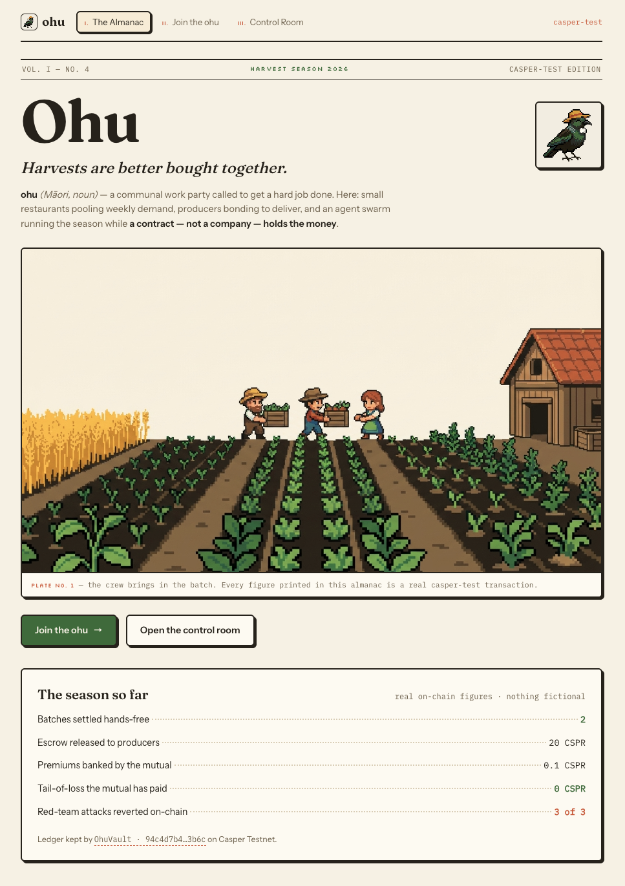
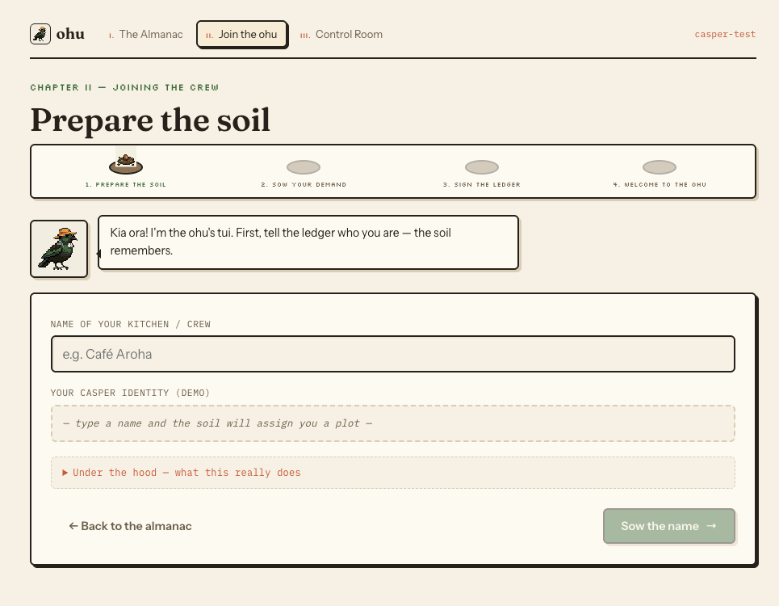
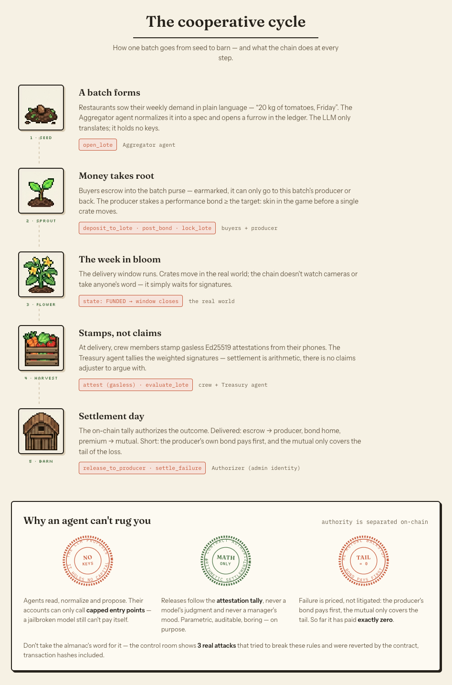
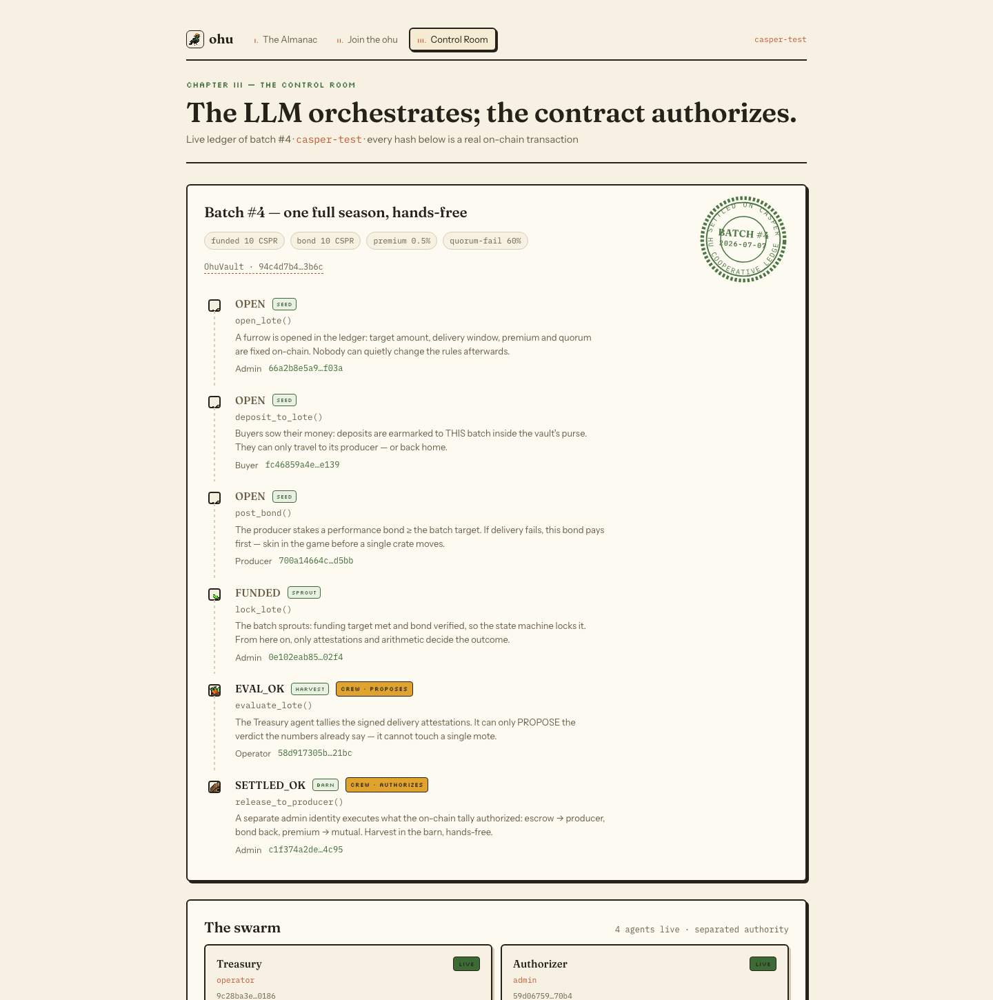

<div align="center">


# Ohu

**Harvests are better bought together.**

Agentic cooperative procurement + a parametric mutual, on Casper.
An LLM swarm runs the season — **the contract authorizes. No capital ever moves on a model's judgment.**


[**Why Ohu**](#why-ohu-exists) · [**Tour**](#the-tour) · [**How it works**](#how-a-batch-works) · [**Can't rug you**](#why-an-agent-cant-rug-you) · [**On Testnet**](#live-on-casper-testnet) · [**Quickstart**](#quickstart) · [**Roadmap**](#roadmap)

*Built for the Casper Agentic Buildathon 2026 — on what is live on Casper Testnet **today**, no unreleased tech on the critical path.*

</div>

---

<div align="center">



*The Cooperative Almanac. Every figure printed on it is a real `casper-test` transaction — nothing fictional.*

</div>

## Why Ohu exists

Small restaurants and producers who pool purchasing already exist (buying clubs, WhatsApp groups) and
die at the same three points — exactly the three Ohu puts on-chain, and *only* those:

1. **Who holds the money?** A human coordinator with the group's bank account is counterparty risk no
   small business accepts at scale. → escrow in a contract `purse`, **earmarked per batch** — a batch's
   funds go to its producer or back to its buyers, nowhere else.
2. **What happens when the order doesn't arrive?** On a $4,000 batch, a claims adjuster or a lawsuit
   costs more than the batch. Nobody insures this — so it doesn't exist. → **parametric** settlement
   over weighted multi-party attestations: arithmetic, not adjudication.
3. **Why does the producer get paid in 30–60 days?** Because nobody guarantees instant payment against
   verified delivery. → vault settlement in seconds once the on-chain threshold is crossed.

Everything else (batch formation, RFQ, communication) stays **off-chain**, where it's cheap. The cannon
points only at the fly that is actually a tank: **enforcement between distrusting small parties who
can't afford traditional enforcement.**

## The tour

Three chapters, one demo — from a restaurant joining the crew to a batch settled hands-free by agents:

| ii · Join the ohu | i · The cooperative cycle |
|---|---|
|  |  |
| A restaurant joins in 4 planting steps — sow your demand, **stamp the ledger** (Ed25519, gasless). Every step opens an honest *"under the hood"* of what happens on-chain. | Seed → Sprout → Flower → Harvest → Barn. Each stage names the **exact entrypoint** that runs it, and three rubber stamps explain why nobody can rug you. |

<div align="center">



*iii · The Swarm Control Room — batch #4's full season, every row a real Testnet transaction, sealed `SETTLED ON CASPER`.*

</div>

Run it locally and click through:

```bash
pnpm --dir web install && pnpm --dir web dev
# /               → The Almanac (landing)
# /onboarding.html → Join the ohu (deep-linkable: ?step=3&name=Cafe%20Aroha&demand=tomato:20)
# /dashboard.html  → Swarm Control Room   ·   append ?theme=dark for the night-field palette
```

## How a batch works

```
   buyers                producer            operator (agent)         admin (native multisig)
     │ deposit (share)     │ post_bond           │ evaluate_lote          │ release / settle
     ▼                     ▼                     ▼                        ▼
 ┌─────────────────────────────────────────────────────────────────────────────────┐
 │  OhuVault (Odra contract, purse escrow, earmarked per batch — INV-7)             │
 │    open_lote → deposit_to_lote → post_bond → lock_lote ─────────────┐            │
 │                                                                      ▼            │
 │  attestation window: buyers sign gasless (Ed25519), operator relays │            │
 │    verify_attestation  →  weighted tally (by share)                 │            │
 │                                                                      ▼            │
 │  evaluate_lote  →  EVAL_OK (silence = received)  or  EVAL_FAIL (≥ quorum negative)│
 │       │                                              │                            │
 │       ▼ release_to_producer                          ▼ settle_failure             │
 │   SETTLED_OK (producer paid − premium)      SETTLED_FAIL (refund + bond slashed)  │
 │       │ premium 0.5%                                  │ tail (deficit)             │
 │       ▼                                               ▼                            │
 │                         MutualPool (premiums in, tail-of-loss backstop)           │
 └─────────────────────────────────────────────────────────────────────────────────┘
```

**Batch state machine:**

```
OPEN ──lock_lote(operator/admin)──▶ FUNDED ──evaluate_lote(after window)──┬─▶ EVAL_OK ──release──▶ SETTLED_OK
                                                                          └─▶ EVAL_FAIL ─settle──▶ SETTLED_FAIL ──withdraw──▶ buyers
```

- **Attestations are gasless.** A buyer signs off-chain (Ed25519 + domain separation over
  `verifying_contract` + `chain_id` + `valid_before`) and the operator relays it on-chain, paying gas.
  The buyer never needs CSPR. *(EIP-712 typed-data is on the roadmap — see [Honest scope](#honest-scope).)*
- **Silence = received.** Not attesting counts as "delivered fine." Only an active, weighted negative
  attestation opens the claim path. This reflects reality and eliminates griefing-by-inaction.
- **The producer's bond is the primary payer of a failure.** It must cover the indemnity target
  (`bond ≥ target`, enforced at `lock_lote`). The mutual is a tail backstop — the one who failed pays
  first.

## Why an agent can't rug you

The whole point of an *agentic* system that moves money: a jailbroken LLM must not be able to touch
capital. Ohu enforces this on-chain, not by trust:

| # | Invariant | How it's enforced |
|---|---|---|
| **INV-1** | The agent never moves relevant capital | The agent's account can only call **capped** entrypoints (bounded micropayments). Every real release requires `caller == admin` + native account multisig |
| **INV-2** | No capital release depends on the LLM's output | Settlement is authorized by an **on-chain condition** — the weighted attestation tally, not a human, not the M-of-N of a person |
| **INV-3** | No Casper Addressable Entity | Custody = contract `purse` + **native account associated-keys/thresholds** + in-contract M-of-N. All live on Testnet today |
| **INV-4** | x402 is only for HTTP services | Escrow settlement is a **contract transfer**, never an x402 flow |
| **INV-5** | Attestations are signed off-chain, verified on-chain (gasless) | Ed25519 + domain separation, anti-replay per `(lote, signer)`, expiry |
| **INV-6** | Closed-circuit data; settlement is arithmetic | No external price/oracle as truth; tally over weighted attestations |
| **INV-7** | Escrow is earmarked per batch | `reserved_lote_balance` — a batch's funds go only to its producer or back to its buyers, never across batches |

> **The LLM orchestrates; the contract authorizes.** This is the answer to the buildathon's core
> question: *how do you let autonomous agents operate real money without a jailbreak ruining anyone?*

And we didn't just claim it — we attacked it. **3 real attacks were sent to Testnet and reverted by the
contract** (`CapExceeded`, `NotAdmin`, `LoteNotFailable`), hashes included, in the Control Room's
red-team section.

## Live on Casper Testnet

Deployed v2 (RPC: `https://node.testnet.casper.network`, chain `casper-test`):

| Contract | Package hash |
|---|---|
| **OhuVault v2** | [`hash-94c4d7b466a035e0aac9bb60daeaa179432ad2df93de3dfe2759812676bf3b6c`](https://testnet.cspr.live/contract-package/hash-94c4d7b466a035e0aac9bb60daeaa179432ad2df93de3dfe2759812676bf3b6c) |
| **MutualPool** | [`hash-2cbbd92b6b3b6ef3629da0330e7b63213a8a04c03b3721b0dbc2a2d73f685cb0`](https://testnet.cspr.live/contract-package/hash-2cbbd92b6b3b6ef3629da0330e7b63213a8a04c03b3721b0dbc2a2d73f685cb0) |

Two full batch lifecycles were executed end-to-end on-chain:

- **Happy path (via tally):** `open → deposit → post_bond → lock_lote → [window, silence=received] →
  evaluate_lote = EVAL_OK → release_to_producer`. Producer paid `funded + bond − premium`; premium to
  the pool. Settlement authorized by the **tally**, not M-of-N.
- **Failure path (indemnifies by rule):** a buyer signs a **negative** attestation (Ed25519, gasless) →
  tally crosses quorum → `evaluate_lote = EVAL_FAIL → settle_failure` (bond slashed) →
  `withdraw_settlement` (buyer refunded + indemnified from the slashed bond). **No human evaluated a
  claim.**

All transaction hashes are in [`infra/deployments/testnet.md`](infra/deployments/testnet.md).

## The agent swarm

Four agents, each with its own on-chain identity and a deliberately narrow authority — the split is the
security model:

| Agent | LLM does (well) | Deterministic / on-chain (authoritative) |
|---|---|---|
| **Aggregator** | normalize fuzzy natural-language demand → structured spec; explain | batching is deterministic bin-packing; RFQ clearing picks the winner; `open_lote` |
| **Treasury** | watch the delivery window; narrate decisions | fires `evaluate_lote` — can only **propose** what the tally already says (INV-2) |
| **Authorizer** | — (it's the admin identity, not a model) | executes `release_to_producer` / `settle_failure` after the on-chain tally (INV-1) |
| **Mutual / Risk** | draft solvency reports; propose premium changes to governance | read-only observer — the premium is changed by the admin, not the model |

A batch (#4) was **settled hands-free** by this swarm on Testnet: the Treasury proposed, the Authorizer
executed, the mutual banked its premium — the full trace is the Control Room's opening screen.

## x402: the reputation oracle

A genuine [x402](https://www.casper.network/ai) pay-per-request service: producers' reputation sold
per HTTP request, using `@make-software/casper-x402` with a failover facilitator (hosted → local).
The server declares its **non-escrow semantics** at `/health` (INV-4): x402 charges for an HTTP
service, it *never* settles escrow. The oracle derives each producer's score from **real on-chain
settlement history** (via CSPR.cloud), with a seed fallback only when no key is configured.
Verified live: producer `33518b62…` returns `4 lotes · 2 OK · 1 FAIL · score 73` `asOfBlock 8425485`.

## Quickstart

```bash
just setup     # Rust + wasm32 + cargo-odra, Node/pnpm
just build     # build contracts + agents
just test      # 206 Odra tests + 24 agent tests + 8 web tests
just lint      # clippy (-D warnings) + typecheck
```

Deploy + run the on-chain batch lifecycle (requires `casper-client`, `binaryen`/`wasm-opt`, a funded
Testnet account, and a `.env` — see `infra/.env.example`):

```bash
bash infra/scripts/deploy_testnet.sh                       # deploy OhuVault v2 + MutualPool
cargo run --bin ohu_livenet_e2e --features livenet         # happy path E2E
cargo run --bin ohu_livenet_e2e_fail --features livenet    # failure path E2E (indemnifies by rule)
```

**Repo layout:** `contracts/` (Odra/Rust — `OhuVault`, `MutualPool`, `attestation`) ·
`agents/` (TypeScript — swarm + x402 rail) · `web/` (the almanac: landing, onboarding, control room) ·
`infra/` (deploy, deployment records) · `docs/` (product spec [`ohu.md`](ohu.md), tech due-diligence
[`techs-specs.md`](techs-specs.md), state [`docs/ESTADO.md`](docs/ESTADO.md)).

## Honest scope

What is **100% real** (deployed + exercised on Testnet): the contracts, the earmarked purse escrow, the
weighted-attestation parametric settlement (both happy and failure paths), the native account multisig
model, the 4-agent swarm settling a batch hands-free, the web almanac, and the x402 oracle rail.

**Honestly bounded / on the roadmap:**

- **Attestations are Ed25519 + domain separation** (gasless, verified on-chain) — the pre-agreed scheme
  from the tech due-diligence. **EIP-712 typed-data is on the roadmap**, not yet implemented. (The x402
  rail *does* use real EIP-712 for its payment authorizations — that's a separate, correct thing.)
- **`Reputation` and `CoopRegistry` contracts are on the roadmap.** Governance params currently live in
  `OhuVault::init`.
- The demo runs a small seeded panel of buyers/producers; delivery is represented by signed
  attestations — which is the *real* mechanism, not a shortcut.

## Roadmap

- [x] Contract layer on Testnet: earmarked escrow, parametric settlement, both E2E paths
- [x] Red-team: 3 real attacks reverted on-chain
- [x] 4-agent swarm — a batch settled hands-free (Treasury proposes, Authorizer executes)
- [x] Aggregator: natural-language demand → deterministic batching → `open_lote`
- [x] Reputation oracle over real on-chain history (x402, CSPR.cloud)
- [x] QR gasless mobile attestation (Ed25519 in the browser)
- [x] Ohu MCP server — Ohu as a market for other agents
- [x] "El Almanaque" web: landing + onboarding + Swarm Control Room
- [ ] Native admin multisig (associated keys, Part B)
- [ ] EIP-712 typed-data attestations
- [ ] `Reputation` / `CoopRegistry` contracts

---

<div align="center">

*Set in Fraunces & Instrument Sans · figures in IBM Plex Mono · pixel art grown in-house · no purple gradients were harmed making this repo.*

**ohu** *(Māori, noun)* — a communal work party called to get a hard job done.

[`ohu.md`](ohu.md) (product) · [`techs-specs.md`](techs-specs.md) (feasibility) · [`docs/ESTADO.md`](docs/ESTADO.md) (build state) · MIT license

</div>
